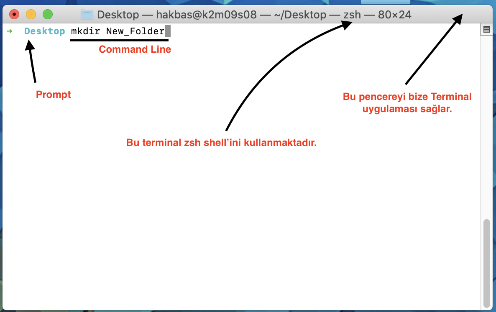

# Terminal vs Bash vs Command Line vs Prompt

## Terminal (Terminal Emulator)

- İşletim sistemi ile metin tabanlı iletişim kurmamızı sağlayan bir uygulamadır.
- Terminal sayesinde çeşitli shell programları ile iletişim kurulabilir.
- Terminale girdiğimiz komutlar shell programına iletilir.

Macos: Terminal, iTerm vb
Linux: GNOME Terminal

## Bash (Bourne Again Shell)

- Unix tabanlı bir shell ve programlama dilidir.
- Birçok Linux dağıtımında ve MacOS'ta bulunabilir.
- Kullanıcı tarafından girilen komutları yorumlar ve çalıştırır.
- Script halindeki programları çalıştırır.

## Command Line

- Metin tabanlı komutların girilebildiği arayüzdür. Terminaller tarafından sağlanır.

## Prompt

- Bir shell'in komut almaya hazır olduğunu bildiren bir sembol veya semboller dizisidir.
- Örnek: **user@hostname:~$**

